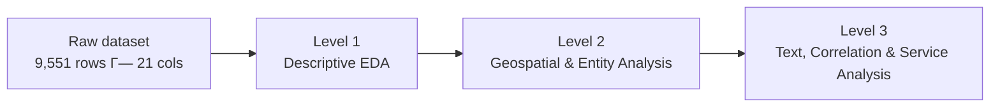

# ZomatoLens

**A three-level analytics case study on restaurant trends in India, built on Zomato's public restaurant dataset.**


[Level 1](Level%201/README.md) · [Level 2](Level%202/README.md) · [Level 3](Level%203/README.md)

---

## Overview

| | |
|---|---|
| **Dataset** | 9,551 restaurants × 21 columns, Zomato export (~91% India, remainder other Zomato-listed countries) |
| **Structure** | 3 independent levels, each a Streamlit dashboard backed by per-task Jupyter notebooks |
| **Scope** | 11 of 11 official Cognifyz tasks (interns were required to complete only 2 of 3 levels) |
| **Internship** | Cognifyz Technologies · Data Analyst Intern · June–July 2025 |
| **License** | MIT |

ZomatoLens answers a progressively deeper set of questions about the dataset — descriptive statistics, then geospatial/structural analysis, then text and correlation analysis — with each level shipped as its own dashboard, notebooks, and exported charts.

## Architecture



| Level | Focus | Official tasks | Implemented |
|---|---|---|---|
| **[Level 1](Level%201/README.md)** | Descriptive EDA — cuisines, cities, price, delivery | 4 | 4/4 |
| **[Level 2](Level%202/README.md)** | Geospatial & entity analysis — ratings, cuisine combos, maps, chains | 4 | 4/4 |
| **[Level 3](Level%203/README.md)** | Text, correlation & service analysis — sentiment, votes, price vs. service | 3 | 3/3 + 1 enrichment |

## Headline metrics

| Metric | Value |
|---|---|
| Top cuisine | North Indian — 41.5% of restaurants |
| 2nd / 3rd cuisine | Chinese 28.6% / Fast Food 20.8% |
| Most-listed city | New Delhi — 5,473 restaurants |
| Price tier split (1→4) | 46.5% · 32.6% · 14.7% · 6.1% |
| Online delivery adoption | 25.7% |
| Rating gap, delivery vs. none | 3.25 vs. 2.47 |
| Votes ↔ rating correlation | 0.31 |
| VADER sentiment ↔ rating correlation | 0.88 (see [Level 3](Level%203/README.md) circularity caveat) |
| Most-voted restaurant | Toit — 10,934 votes, 4.8 rating |
| Table booking by price tier (1→4) | 0% · 7.7% · 45.7% · 46.8% |
| Restaurant chains | 734 of 7,446 unique names have >1 branch |

All figures computed directly from the dataset — not estimated.

## Capabilities by level

| Capability | Level 1 | Level 2 | Level 3 |
|---|:---:|:---:|:---:|
| Descriptive statistics (counts, %) | ✅ | | |
| Categorical aggregation (`groupby`) | ✅ | ✅ | |
| Geospatial visualization (Plotly + OSM/CARTO) | | ✅ | |
| Entity / chain analysis | | ✅ | |
| Sentiment analysis (VADER, TextBlob) | | | ✅ |
| NLP enrichment (spaCy noun-chunks) | | | ✅ |
| Correlation analysis | | | ✅ |
| Service-adoption analysis | | | ✅ |

## Technical stack

| Category | Technologies |
|---|---|
| Language | Python 3 |
| Data handling | Pandas, NumPy |
| Visualization | Plotly Express & Graph Objects, Matplotlib, Seaborn, WordCloud |
| Application | Streamlit |
| NLP & sentiment | NLTK (VADER), TextBlob, spaCy (`en_core_web_sm`) |
| Geospatial | Plotly `scatter_mapbox` — OpenStreetMap / CARTO tiles, no paid API |
| Styling | Custom CSS — dark, glass-panel theme |

## Dataset fields

`Restaurant Name` · `City` · `Cuisines` · `Average Cost for two` · `Currency` · `Price range` · `Has Online delivery` · `Has Table booking` · `Aggregate rating` · `Rating text` · `Votes` · `Latitude` · `Longitude`

## Repository structure

```
ZomatoLens-A-Data-Driven-Exploration-of-Restaurant-Trends-in-India/
├── LICENSE
├── README.md
├── Level 1/   → level1_dashboard.py + Task 1–4 (notebooks + HTML exports)
├── Level 2/   → level2_dashboard.py + Task 1–4 (notebooks + PNG exports)
└── Level 3/   → level3_dashboard.py + Task 1–3 (notebooks + PNG exports)
```

Each level folder is self-contained: dashboard script, `style.css`, dataset CSV, and per-task notebooks. Full trees are in each level's own README.

## Pipeline

`Load CSV` → `Clean / filter columns` → `Aggregate or score with Pandas` → `Render as Plotly / Matplotlib charts` → `Streamlit UI`. Level 3 inserts an NLP pass (VADER → TextBlob → spaCy) before visualization. Every dashboard has an **Export CSV** button that writes a summary table.

## Run it

No shared `requirements.txt` — each level installs independently:

```bash
git clone https://github.com/Riddhis2226/ZomatoLens-A-Data-Driven-Exploration-of-Restaurant-Trends-in-India.git
cd "ZomatoLens-A-Data-Driven-Exploration-of-Restaurant-Trends-in-India"
```

| Level | Install | Run |
|---|---|---|
| 1 | `pip install streamlit pandas numpy plotly` | `streamlit run "Level 1/level1_dashboard.py"` |
| 2 | `pip install streamlit pandas plotly` | `streamlit run "Level 2/level2_dashboard.py"` |
| 3 | `pip install streamlit pandas plotly matplotlib seaborn wordcloud nltk textblob spacy` + `python -m spacy download en_core_web_sm` | `streamlit run "Level 3/level3_dashboard.py"` |

Run from inside each level's folder — dashboards resolve the CSV and `style.css` relative to their own file.

## Internship scope

| | |
|---|---|
| Organization | Cognifyz Technologies |
| Role | Data Analyst Intern |
| Duration | June–July 2025 |
| Requirement | Any 2 of 3 levels |
| Delivered | All 3 levels, 11/11 official tasks, 1 additional NLP enrichment |

## Links

- Repo: [ZomatoLens](https://github.com/Riddhis2226/ZomatoLens-A-Data-Driven-Exploration-of-Restaurant-Trends-in-India)
- [Level 1](Level%201/README.md) · [Level 2](Level%202/README.md) · [Level 3](Level%203/README.md)
- [LinkedIn](https://www.linkedin.com/in/riddhima-singh-a7383431a)

## License

[MIT](LICENSE). Dataset is a modified Zomato export provided via the Cognifyz Technologies internship program, included for educational and portfolio purposes.
