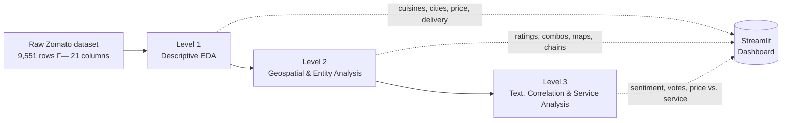

# ZomatoLens

**A three-level analytics case study on restaurant trends in India, built on Zomato's public restaurant dataset.**


[Level 1](Level%201/README.md) · [Level 2](Level%202/README.md) · [Level 3](Level%203/README.md)

---

## What this is

ZomatoLens is a three-part exploratory analytics project built on a ~9,500-row Zomato restaurant dataset. Each level is an independent Streamlit dashboard, backed by its own set of Jupyter notebooks and exported visualizations, that answers a progressively deeper set of analytical questions — starting with descriptive statistics, moving into geospatial and entity-level structure, and ending with text and relationship analysis.

The project was built during a four-week Data Analysis Internship at **Cognifyz Technologies** (June–July 2025). Interns were asked to complete any two of three difficulty levels; this repository implements all three.

## Why this dataset

The dataset raises a set of practical questions any food-delivery or restaurant-discovery product would care about: which cuisines dominate the market, which cities are saturated versus underserved, how price tier relates to service adoption (delivery, table booking), and whether customer engagement (votes, ratings) tracks any of that. ZomatoLens works through those questions layer by layer rather than as one flat notebook.

## Analytical architecture



| Level | Focus | Question it answers |
|---|---|---|
| **[Level 1](Level%201/README.md)** | Descriptive EDA | What does the restaurant landscape look like at a glance? |
| **[Level 2](Level%202/README.md)** | Geospatial & structural analysis | Where are restaurants concentrated, and how do cuisine combinations and chains behave? |
| **[Level 3](Level%203/README.md)** | Text, correlation & service analysis | Do engagement signals (votes, sentiment) and price tier relate to service offerings? |

## Internship scope vs. this implementation

The Cognifyz brief defines three levels of four, four, and three tasks respectively, and asks interns to complete any two levels of their choice. This repository completes **all three levels (11 of 11 official tasks)**, plus one additional NLP enrichment in Level 3 that is *not* part of the official brief (see the [Level 3 README](Level%203/README.md) for how that's scoped).

| Level | Official tasks | Implemented | Notes |
|---|---|---|---|
| Level 1 | 4 | 4 | Cuisines, city analysis, price distribution, online delivery |
| Level 2 | 4 | 4 | Ratings, cuisine combinations, geography, restaurant chains |
| Level 3 | 3 | 3 + 1 enrichment | Reviews, votes, price-vs-service, plus spaCy noun-phrase extraction as an enrichment of the review task |

## Analytical capabilities

- **Descriptive statistics** — frequency counts, percentages, and distributions across cuisines, cities, and price tiers (Level 1)
- **Categorical aggregation** — `groupby`-based summaries of ratings by city, cuisine combination, and restaurant chain (Levels 1–2)
- **Geospatial visualization** — restaurant-level scatter maps rendered with free OpenStreetMap / CARTO tiles via Plotly (Level 2)
- **Entity analysis** — restaurant-chain identification by repeated name, with branch count, average rating, and total votes tracked separately (Level 2)
- **Sentiment analysis** — VADER and TextBlob polarity scoring (Level 3)
- **NLP enrichment** — spaCy noun-chunk frequency extraction (Level 3)
- **Correlation analysis** — votes-vs-rating and review-length-vs-rating relationships, reported as correlation coefficients, not causal claims (Level 3)
- **Service-adoption analysis** — online delivery and table booking uptake broken down by price tier (Level 3)

## Technical stack

| Category | Technologies |
|---|---|
| Language | Python 3 |
| Data handling | Pandas, NumPy |
| Visualization | Plotly Express & Graph Objects, Matplotlib, WordCloud |
| Application | Streamlit |
| NLP & sentiment | NLTK (VADER), TextBlob, spaCy (`en_core_web_sm`) |
| Geospatial | Plotly `scatter_mapbox` on OpenStreetMap / CARTO tile layers |
| Styling | Hand-written CSS (dark, glass-panel dashboard theme) |

## Data & features

The dataset is a modified export of Zomato's public restaurant listings (`Data Analysis Internship__Dataset__Cognifyz Technologies.csv`, ~9,551 rows, 21 columns), included separately in each level's folder. About 91% of rows carry an Indian country code, with the remainder drawn from other countries also present on Zomato — the "trends in India" framing reflects that the dataset is overwhelmingly India-centric, not that every row is Indian.

Fields used across the three levels: `Restaurant Name`, `City`, `Cuisines`, `Average Cost for two`, `Currency`, `Price range`, `Has Online delivery`, `Has Table booking`, `Aggregate rating`, `Rating text`, `Votes`, `Latitude`, `Longitude`.

## Repository architecture

```
ZomatoLens-A-Data-Driven-Exploration-of-Restaurant-Trends-in-India/
├── LICENSE
├── README.md
├── Level 1/
│   ├── README.md
│   ├── level1_dashboard.py
│   ├── style.css
│   ├── Data Analysis Internship__Dataset__Cognifyz Technologies.csv
│   ├── Task 1/   → top_cuisines.ipynb + 3 exported HTML charts
│   ├── Task 2/   → city_analysis.ipynb + 3 exported HTML charts
│   ├── Task 3/   → price_range.ipynb + 3 exported HTML charts
│   └── Task 4/   → online_delivery_advanced.ipynb + 3 exported HTML charts
├── Level 2/
│   ├── README.md
│   ├── level2_dashboard.py
│   ├── style.css
│   ├── Data Analysis Internship__Dataset__Cognifyz Technologies.csv
│   ├── Task 1/   → Task 1.ipynb + 3 exported PNGs
│   ├── Task 2/   → Task 2.ipynb + 1 exported PNG
│   ├── Task 3/   → Task 3.ipynb + 4 exported PNGs
│   └── Task 4/   → Task 4.ipynb + 1 exported PNG
└── Level 3/
    ├── README.md
    ├── level3_dashboard.py
    ├── style.css
    └── Data Analysis Internship__Dataset__Cognifyz Technologies.csv
```

Level 1 and Level 2 each keep their exploratory notebooks and static chart exports alongside the consolidated dashboard; Level 3 ships as a single dashboard script with no separate per-task notebooks or exported images.

## How it works

Each level follows the same shape: **load the CSV → clean/filter the relevant columns → compute aggregates or scores with Pandas → render the result as one or more Plotly/Matplotlib charts inside a Streamlit page**. Level 3 adds an NLP pass (VADER, TextBlob, spaCy) before the visualization step. Every dashboard also exposes a "download processed data" button that writes a summary CSV of the level's computed tables.

## Running the project

Each level is a standalone Streamlit app and reads its dataset and stylesheet from its own folder — there is no shared `requirements.txt` in the repository, so install per level:

```bash
git clone https://github.com/Riddhis2226/ZomatoLens-A-Data-Driven-Exploration-of-Restaurant-Trends-in-India.git
cd "ZomatoLens-A-Data-Driven-Exploration-of-Restaurant-Trends-in-India"

# Level 1
pip install streamlit pandas numpy plotly
streamlit run "Level 1/level1_dashboard.py"

# Level 2
pip install streamlit pandas plotly
streamlit run "Level 2/level2_dashboard.py"

# Level 3
pip install streamlit pandas plotly matplotlib wordcloud nltk textblob spacy
python -m spacy download en_core_web_sm
streamlit run "Level 3/level3_dashboard.py"
```

Each dashboard resolves its CSV and `style.css` relative to its own file, so run it from inside that level's folder (or leave the folder structure intact) rather than moving the script elsewhere.

## Outputs & visual exploration

Level 1's notebooks export interactive Plotly HTML files (donut, lollipop, treemap, heatmap-style bar, and a Sankey view of delivery → rating flow) under each `Task N/` folder. Level 2's notebooks export static PNGs — rating distributions, a cuisine-combination bar chart, city-zoomed rating maps for New Delhi, Mumbai, and Bangalore, and a chain-popularity chart. Level 3 renders everything live inside its Streamlit app; no static exports are checked into that folder.

## Analytical findings

Verified directly against the dataset (not estimated):

| Metric | Value |
|---|---|
| Top cuisine | North Indian — 41.5% of restaurants |
| Second / third cuisine | Chinese (28.6%) / Fast Food (20.8%) |
| Most-listed city | New Delhi — 5,473 restaurants |
| Price tier distribution | Budget 46.5% · Mid 32.6% · Premium 14.7% · Luxury 6.1% |
| Online delivery adoption | 25.7% of restaurants offer it |
| Rating gap by delivery | 3.25 avg. rating with delivery vs. 2.47 without |
| Votes–rating correlation | 0.31 (weak positive association) |
| Table booking by price tier | 0% → 7.7% → 45.7% → 46.8% across tiers 1–4 |

These are associations observed in the data, not causal claims — see each level's README for the exact scope of what was measured.

## Internship context

- **Organization:** Cognifyz Technologies
- **Role:** Data Analyst Intern
- **Duration:** June–July 2025
- **Deliverables:** three level-wise Streamlit dashboards, backed by per-task Jupyter notebooks and exported visualizations

## Project links

- Repository: [ZomatoLens](https://github.com/Riddhis2226/ZomatoLens-A-Data-Driven-Exploration-of-Restaurant-Trends-in-India)
- [Level 1 README](Level%201/README.md) · [Level 2 README](Level%202/README.md) · [Level 3 README](Level%203/README.md)
- [LinkedIn](https://www.linkedin.com/in/riddhima-singh-a7383431a)

## License & usage

Released under the [MIT License](LICENSE). The dataset itself is a modified Zomato export provided as part of the Cognifyz Technologies internship program and is included for educational and portfolio purposes.
