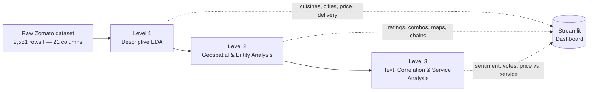

# ZomatoLens

**A three-level analytics case study on restaurant trends in India, built on Zomato's public restaurant dataset.**


[Level 1](Level%201/README.md) · [Level 2](Level%202/README.md) · [Level 3](Level%203/README.md)

---

## At a glance

| | |
|---|---|
| Dataset | 9,551 restaurants · 21 columns · 141 cities · ~91% India-based |
| Scope | 3 levels · 11/11 official Cognifyz tasks · 1 additional NLP enrichment |
| Deliverables | 3 independent Streamlit dashboards · 11 per-task Jupyter notebooks · 30+ exported charts |
| Internship | Cognifyz Technologies · Data Analyst Intern · June–July 2025 |

ZomatoLens answers a progressively deeper set of questions about the restaurant landscape:

- **Level 1 — Descriptive EDA:** cuisine share, city concentration, price tiers, delivery adoption
- **Level 2 — Geospatial & structural:** rating distribution, cuisine combinations, geography, chains
- **Level 3 — Text, correlation & service:** sentiment, votes-rating correlation, price vs. service

Cognifyz interns were asked to complete any two of three levels; this repository implements all three.

## Why this dataset

Questions any food-delivery or restaurant-discovery product would care about:

- Which cuisines dominate the market, and by how much
- Which cities are saturated vs. underserved
- How price tier relates to service adoption (delivery, table booking)
- Whether customer engagement (votes, ratings, sentiment) tracks any of that

ZomatoLens works through these layer by layer rather than as one flat notebook.

## Analytical architecture



| Level | Focus | Question it answers |
|---|---|---|
| **[Level 1](Level%201/README.md)** | Descriptive EDA | What does the restaurant landscape look like at a glance? |
| **[Level 2](Level%202/README.md)** | Geospatial & structural analysis | Where are restaurants concentrated, and how do cuisine combinations and chains behave? |
| **[Level 3](Level%203/README.md)** | Text, correlation & service analysis | Do engagement signals (votes, sentiment) and price tier relate to service offerings? |

## Internship scope vs. implementation

| Level | Official tasks | Implemented | Coverage |
|---|---|---|---|
| Level 1 | 4 | 4 | Cuisines, city analysis, price distribution, online delivery |
| Level 2 | 4 | 4 | Ratings, cuisine combinations, geography, restaurant chains |
| Level 3 | 3 | 3 + 1 enrichment | Reviews, votes, price-vs-service, plus spaCy noun-phrase extraction (extension of the review task, not an official task) |
| **Total** | **11** | **11 + 1** | **100% task coverage, all 3 levels completed** |

## Analytical capabilities

| Capability | Method | Level |
|---|---|---|
| Descriptive statistics | Frequency counts, percentages, distributions | 1 |
| Categorical aggregation | `groupby` summaries by city, cuisine combo, chain | 1–2 |
| Geospatial visualization | Plotly `scatter_mapbox` on OpenStreetMap / CARTO | 2 |
| Entity analysis | Chain detection by repeated name — branch count, avg. rating, votes tracked separately | 2 |
| Sentiment analysis | VADER + TextBlob polarity scoring | 3 |
| NLP enrichment | spaCy noun-chunk frequency extraction | 3 |
| Correlation analysis | Pearson coefficients (votes–rating, sentiment–rating) — no causal claims | 3 |
| Service-adoption analysis | Delivery/booking uptake by price tier | 3 |

## Technical stack

| Category | Technologies |
|---|---|
| Language | Python 3 |
| Data handling | Pandas, NumPy |
| Visualization | Plotly Express & Graph Objects, Matplotlib, Seaborn, WordCloud |
| Application | Streamlit |
| NLP & sentiment | NLTK (VADER), TextBlob, spaCy (`en_core_web_sm`) |
| Geospatial | Plotly `scatter_mapbox` — OpenStreetMap / CARTO tiles, no paid API |
| Styling | Hand-written CSS — dark, glass-panel dashboard theme |

## Data & features

| | |
|---|---|
| File | `Data Analysis Internship__Dataset__Cognifyz Technologies.csv` (one copy per level) |
| Size | 9,551 rows × 21 columns |
| Geography | 141 cities · ~91% India-based (rest also drawn from Zomato's global listings) |
| Key fields | `Restaurant Name`, `City`, `Cuisines`, `Average Cost for two`, `Currency`, `Price range`, `Has Online delivery`, `Has Table booking`, `Aggregate rating`, `Rating text`, `Votes`, `Latitude`, `Longitude` |

## Repository architecture

```
ZomatoLens-A-Data-Driven-Exploration-of-Restaurant-Trends-in-India/
├── LICENSE
├── README.md
├── Level 1/
│   ├── README.md · level1_dashboard.py · style.css · dataset.csv
│   ├── Task 1/   → top_cuisines.ipynb + 3 HTML exports
│   ├── Task 2/   → city_analysis.ipynb + 3 HTML exports
│   ├── Task 3/   → price_range.ipynb + 3 HTML exports
│   └── Task 4/   → online_delivery_advanced.ipynb + 3 HTML exports
├── Level 2/
│   ├── README.md · level2_dashboard.py · style.css · dataset.csv
│   ├── Task 1/   → Task 1.ipynb + 3 PNG exports
│   ├── Task 2/   → Task 2.ipynb + 1 PNG export
│   ├── Task 3/   → Task 3.ipynb + 4 PNG exports
│   └── Task 4/   → Task 4.ipynb + 1 PNG export
└── Level 3/
    ├── README.md · level3_dashboard.py · style.css · dataset.csv
    ├── Task 1/   → task_1.ipynb + 1 PNG export
    ├── Task 2/   → task_2.ipynb + 3 PNG exports
    └── Task 3/   → task_3.ipynb + 2 PNG exports
```

## How it works

`Load CSV` → `clean/filter columns` → `aggregate or score with Pandas` → `render via Plotly/Matplotlib in Streamlit`. Level 3 inserts an NLP pass (VADER → TextBlob → spaCy) before visualization. Every dashboard ships an **Export CSV** button that writes a summary table of that level's computed results.

## Running the project

No shared `requirements.txt` — each level installs independently:

```bash
git clone https://github.com/Riddhis2226/ZomatoLens-A-Data-Driven-Exploration-of-Restaurant-Trends-in-India.git
cd "ZomatoLens-A-Data-Driven-Exploration-of-Restaurant-Trends-in-India"

# Level 1
pip install streamlit pandas numpy plotly
streamlit run "Level 1/level1_dashboard.py"

# Level 2
pip install streamlit pandas plotly
streamlit run "Level 2/level2_dashboard.py"

# Level 3
pip install streamlit pandas plotly matplotlib seaborn wordcloud nltk textblob spacy
python -m spacy download en_core_web_sm
streamlit run "Level 3/level3_dashboard.py"
```

Run each dashboard from inside its own level folder — the CSV and `style.css` are resolved relative to the script.

## Outputs & visual exploration

| Level | Export type | Highlights |
|---|---|---|
| 1 | Interactive Plotly HTML | Donut, lollipop, treemap, heatmap-style bar, Sankey (delivery → rating) |
| 2 | Static PNG | Rating distributions, cuisine-combo bar chart, city-zoomed maps (Delhi, Mumbai, Bangalore), chain-popularity chart |
| 3 | Static PNG | Review-length distribution, vote distribution, votes-vs-rating scatter, price-vs-delivery charts |

## Analytical findings

| Metric | Value |
|---|---|
| Top cuisine | North Indian — **41.5%** of restaurants |
| 2nd / 3rd cuisine | Chinese (**28.6%**) / Fast Food (**20.8%**) |
| Most-listed city | New Delhi — **5,473** restaurants |
| Price tier distribution | Budget **46.5%** · Mid **32.6%** · Premium **14.7%** · Luxury **6.1%** |
| Online delivery adoption | **25.7%** of restaurants |
| Rating gap by delivery | **3.25** avg. rating with delivery vs. **2.47** without |
| Votes–rating correlation | **0.31** (weak positive) |
| Sentiment–rating correlation | **0.88** (proxy text — see Level 3 methodology note) |
| Most-voted restaurant | Toit — **10,934** votes, 4.8 rating |
| Table booking, tier 1 → 4 | 0% → 7.7% → 45.7% → **46.8%** |

Associations observed in the data — not causal claims. Full scope of each measurement is in the level READMEs.

## Internship context

| | |
|---|---|
| Organization | Cognifyz Technologies |
| Role | Data Analyst Intern |
| Duration | June–July 2025 |
| Deliverables | 3 level-wise Streamlit dashboards, 11 per-task Jupyter notebooks, 30+ exported visualizations |

## Project links

- Repository: [ZomatoLens](https://github.com/Riddhis2226/ZomatoLens-A-Data-Driven-Exploration-of-Restaurant-Trends-in-India)
- [Level 1 README](Level%201/README.md) · [Level 2 README](Level%202/README.md) · [Level 3 README](Level%203/README.md)
- [LinkedIn](https://www.linkedin.com/in/riddhima-singh-a7383431a)

## License & usage

Released under the [MIT License](LICENSE). Dataset is a modified Zomato export provided as part of the Cognifyz Technologies internship program, included for educational and portfolio purposes.
